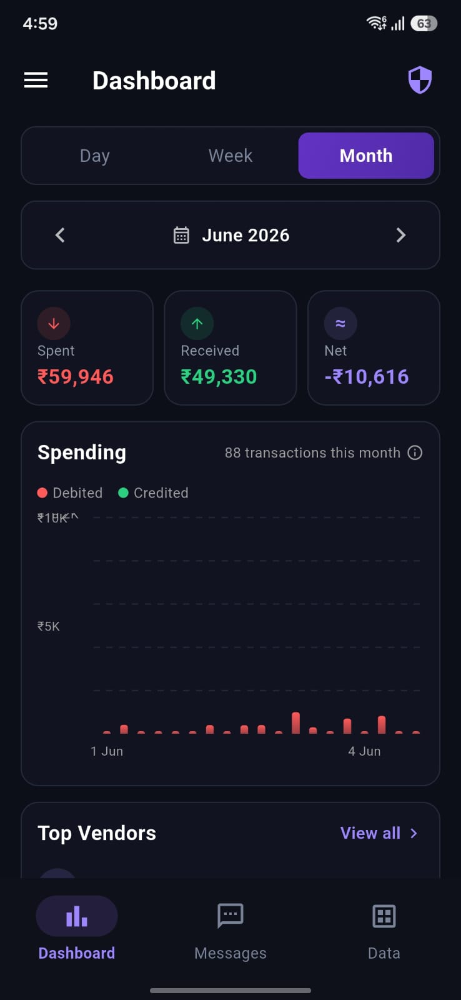
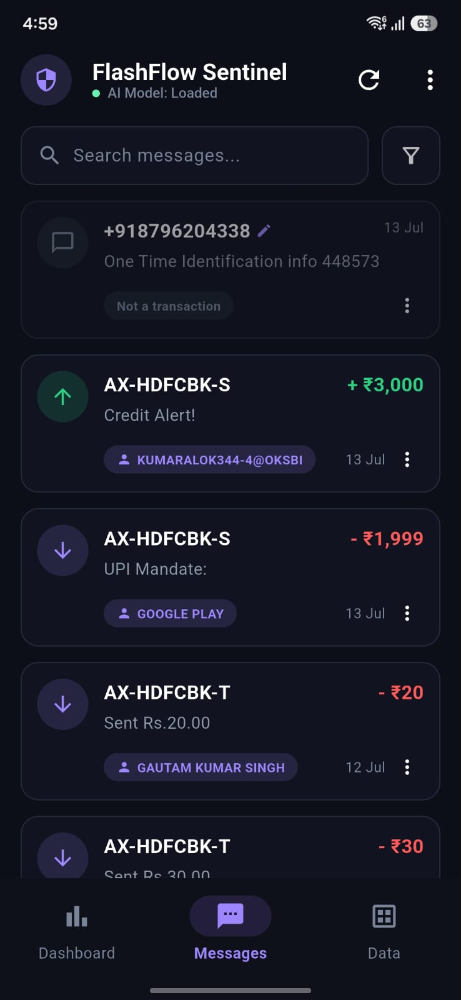

# FlashFlow Sentinel 

**A 100% offline, on-device AI financial tracker that reads your bank SMS and turns them into structured, queryable transactions — without a single byte ever leaving your phone.**

[](https://huggingface.co/4-alokk/flashflow-qwen3-0.6b-bank-sms)
[](https://huggingface.co/datasets/4-alokk/flashflow-bank-sms)
[](https://flutter.dev)
[]()

<p align="center">
  
  &nbsp;&nbsp;&nbsp;&nbsp;
  
</p>

---

## Table of Contents

- [What is this?](#what-is-this)
- [Why fully offline?](#why-fully-offline)
- [Architecture: The Two-Stage AI Pipeline](#architecture-the-two-stage-ai-pipeline)
  - [Stage 1 — TF-IDF + Logistic Regression Gatekeeper](#stage-1--tf-idf--logistic-regression-gatekeeper)
  - [Stage 2 — Fine-Tuned Qwen3-0.6B Generative Extractor](#stage-2--fine-tuned-qwen3-06b-generative-extractor)
- [How the Qwen model was fine-tuned](#how-the-qwen-model-was-fine-tuned)
- [How the synthetic dataset was generated](#how-the-synthetic-dataset-was-generated)
- [The on-device feedback loop](#the-on-device-feedback-loop)
- [App features](#app-features)
- [Project structure](#project-structure)
- [Getting started](#getting-started)
- [Model & dataset links](#model--dataset-links)
- [Tech stack](#tech-stack)

---

## What is this?

Every bank transaction in India (and most of South Asia) triggers an unstructured SMS. Dozens of banks, hundreds of merchant formats, inconsistent date styles, cryptic abbreviations — there is no reliable way to turn that mess into structured data with regex alone, and sending private financial messages to a cloud API is a privacy non-starter.

**FlashFlow Sentinel** solves this on the device itself. It is a Flutter app that:

1. **Reads** your SMS inbox (with your permission),
2. **Filters** transactional messages from OTPs/promos/spam using a tiny TF-IDF + Logistic Regression classifier, re-implemented in pure Dart,
3. **Extracts** a 13-field structured JSON record from each transactional SMS using a **fine-tuned Qwen3-0.6B small language model** running locally via `llama.cpp`,
4. **Visualizes** your spending with interactive charts, and
5. **Learns from your corrections** — every manual fix is logged in the exact training-data format, so the model can be improved with real-world data over time.

Every SMS is parsed into this schema:

```json
{
  "transaction_type": "debit",
  "amount": 449.0,
  "currency": "INR",
  "date": "2026-06-14",
  "time": "19:32",
  "sender_bank": "HDFC Bank",
  "sender_acc": "XX1234",
  "receiver_bank": null,
  "receiver_acc": null,
  "counterparty_name": "SWIGGY",
  "reference_id": "615243987012",
  "balance_after": 18230.55,
  "is_actionable": true
}
```

## Why fully offline?

There is **no backend, no API key, no analytics SDK, and no network call** anywhere in the inference path:

- **The classifier** is a 55 KB JSON file of TF-IDF vocabulary + logistic-regression weights, bundled as a Flutter asset and evaluated in pure Dart.
- **The language model** is a 4-bit quantized GGUF (~378 MB) of a fine-tuned Qwen3-0.6B, bundled with the app and executed by `llama.cpp` on the phone's own CPU/GPU (with Vulkan acceleration auto-detected on supported Android devices).
- **All storage** is a local [Hive](https://pub.dev/packages/hive_ce) database on the device.

Your financial data never leaves your phone. The app works identically in airplane mode.

## Architecture: The Two-Stage AI Pipeline

Running a language model over *every* SMS would waste battery — most messages are OTPs, promos, and spam. So FlashFlow uses a classic **cascade architecture**: a cheap, fast filter in front of an expensive, accurate extractor.

```
                    ┌──────────────────────────────────────────────┐
                    │                YOUR PHONE                    │
                    │                                              │
  SMS Inbox ──────► │  SmsSyncService                              │
                    │      │  (incremental, watermark-based sync)  │
                    │      ▼                                       │
                    │  STAGE 1: SmsClassifierService               │
                    │  TF-IDF + Logistic Regression (pure Dart)    │
                    │  ~55 KB model · <1 ms per message            │
                    │      │                                       │
                    │      ├── p < 0.80 ──► ignored (OTP/promo)    │
                    │      ▼   p ≥ 0.80                            │
                    │  STAGE 2: ExtractionQueueService             │
                    │  Sequential background queue                 │
                    │      │                                       │
                    │      ▼                                       │
                    │  GenerativeExtractorService                  │
                    │  Fine-tuned Qwen3-0.6B (Q4_K_M GGUF)         │
                    │  via llama.cpp · Vulkan GPU offload          │
                    │      │                                       │
                    │      ▼                                       │
                    │  Structured JSON ──► Hive DB ──► Dashboard   │
                    │                                              │
                    │  User corrections ──► CorrectionService      │
                    │  ──► exportable JSONL in training format     │
                    └──────────────────────────────────────────────┘
```

### Stage 1 — TF-IDF + Logistic Regression Gatekeeper

A **TF-IDF (Term Frequency–Inverse Document Frequency)** vectorizer paired with **Logistic Regression**, trained in Python with scikit-learn (`train_classifier.py` in the training pipeline) and then **re-implemented from scratch in pure Dart** ([`lib/app/data/services/sms_classifier_service.dart`](lib/app/data/services/sms_classifier_service.dart)) so the app needs no ML runtime at all for this stage.

**Training (Python, offline, one-time):**
- Trained on the same 15K synthetic SMS dataset used for the SLM. Labels are derived automatically: a sample is "non-transactional" when `amount` is null/0 **and** `transaction_type` is null.
- `TfidfVectorizer` with `min_df=5` (drops one-off numbers/hashes, shrinking the vocabulary) and `max_df=0.95` (drops ubiquitous background words).
- `LogisticRegression` with L2 penalty and `class_weight='balanced'` to correct the ~80/20 transaction/noise imbalance.
- The fitted vocabulary, IDF values, weight vector, intercept, and a decision threshold of **0.80** are serialized to a single JSON file: `assets/models/classifier_model.json` (~55 KB).

**Inference (Dart, on-device, per message):**
1. Lowercase and strip everything except `a-z`, `0-9`, and whitespace (a hand-rolled character scan, byte-identical to the Python preprocessing — this parity is critical for the weights to be valid).
2. Compute term frequencies, multiply by the stored IDF values, **L2-normalize** the sparse vector.
3. Dot product with the trained weights + intercept, then a numerically-stable **sigmoid**.
4. If probability ≥ **0.80** → the message is transactional and goes to Stage 2; otherwise it's marked non-transactional and never touches the LLM.

This gate is effectively free (a few dictionary lookups per message) and means the expensive model only ever runs on the ~20% of messages that matter. If the classifier fails to load, it **fails open** — everything is passed to the SLM rather than silently dropping transactions.

### Stage 2 — Fine-Tuned Qwen3-0.6B Generative Extractor

Instead of brittle regex or classic NER, FlashFlow uses **autoregressive structured generation**: a small language model reads the raw SMS and directly *writes* the 13-field JSON object. This is dramatically more robust to the long tail of real-world formatting — new bank templates, typos, and odd date formats that would break any pattern matcher.

The model is **Qwen3-0.6B, LoRA fine-tuned** on the extraction task (details below), merged, quantized to **Q4_K_M GGUF** (~378 MB), and bundled as a Flutter asset.

> ℹ️ The asset file is named `smollm-q4_k_m.gguf` for legacy reasons (SmolLM2 was an earlier candidate model) — the file actually contains the fine-tuned **Qwen3-0.6B**.

On-device inference ([`generative_extractor_service.dart`](lib/app/data/services/generative_extractor_service.dart)):

- Runs via [`llama_flutter_android`](https://pub.dev/packages/llama_flutter_android), a `llama.cpp` binding.
- **GPU auto-detection**: probes for Vulkan support and offloads the recommended number of layers to the GPU; falls back to 4 CPU threads.
- **Prompt-template parity**: the ChatML prompt sent at inference is byte-identical to the `instruction` field of the training dataset — same system prompt, same `SMS: <text>` format. Any drift here degrades accuracy, so the system prompt is a single shared constant reused by the export pipeline too.
- Generation runs at `temperature 0.1`, max 160 tokens, 512-token context, with a 15-second timeout, KV-cache clearing between messages, and defensive JSON cleanup (strips ChatML suffixes, markdown fences, trailing junk).

**The extraction queue** ([`extraction_queue_service.dart`](lib/app/data/services/extraction_queue_service.dart)) makes this practical on a phone:
- Strictly **sequential** — one inference at a time, results persisted immediately, so each SMS is extracted **at most once per install** even across app restarts.
- Only messages from the **last 60 days** are auto-extracted after a sync; older history is extracted on explicit user request, so a fresh install doesn't burn battery churning through months of old SMS.
- Holds a wakelock during processing and retries failed extractions up to 2 times.

## How the Qwen model was fine-tuned

The fine-tuned model is published here: **🤗 [4-alokk/flashflow-qwen3-0.6b-bank-sms](https://huggingface.co/4-alokk/flashflow-qwen3-0.6b-bank-sms)**

Training lives in the parent FlashFlow repo as a **config-driven, multi-model experiment framework** (`scripts/train_autoregressive.py` + one YAML per candidate model), built to benchmark 7 SLM candidates (125M–1B params: MobileLLM, SmolLM2, Qwen2.5/3, Gemma-3) head-to-head on identical hyperparameters, with MLflow tracking. Qwen3-0.6B is the current production winner.

**Recipe (Qwen3-0.6B):**

| Setting | Value |
|---|---|
| Base model | `Qwen/Qwen3-0.6B` |
| Method | LoRA (PEFT) + TRL `SFTTrainer` |
| LoRA rank / alpha / dropout | 16 / 32 / 0.05 |
| Target modules | `q_proj, k_proj, v_proj, o_proj, gate_proj, up_proj, down_proj` |
| Steps | 1,500 (effective batch 16 = 2 × 8 grad accumulation) |
| Learning rate | 1.5e-4, cosine schedule, 150 warmup steps |
| Max sequence length | 512 |
| Hardware | Auto-detects MPS (Apple Silicon) / CUDA / CPU |

**Deployment pipeline:** LoRA adapter → merge into base weights → convert to GGUF with `llama.cpp` → quantize to **Q4_K_M** (`scripts/export_gguf.py`) → drop into `assets/models/`.

**Evaluation** (`scripts/evaluate.py`) scores every candidate on a held-out, manually reviewed 200-sample eval set:
- **JSON validity rate** (target > 95%)
- **Macro F1** across all 13 fields (target > 85%)
- **Per-field accuracy** for each of the 13 fields
- **p50 / p95 inference latency** (target < 500 ms on mid-range Android)

## How the synthetic dataset was generated

Real bank SMS can't be scraped or shared at scale (privacy), so the training data is **fully synthetic**, produced by a purpose-built generator (`scripts/generate_dataset_v2.py`, ~1,200 lines) and published here: **🤗 [4-alokk/flashflow-bank-sms](https://huggingface.co/datasets/4-alokk/flashflow-bank-sms)**

The generator composes realistic Indian bank SMS from layered lookup tables and templates:

- **15,000+ training samples** (`--num_samples 15000 --seed 42`) plus a **200-sample eval set** generated with a *different* seed (`--seed 99`) and then **manually reviewed**, so eval never overlaps train.
- **200+ unique vendors** across realistic spending categories (food delivery, groceries, transport, utilities, rent, salary…) with **category-aware amount ranges** — a coffee costs ₹180, not ₹1,80,000; a salary credit is not ₹45.
- **500+ person / UPI-handle combinations** (`rajeshkumar@okaxis`, `priyasharma@ybl`, …) across 18 banks and 6 wallets.
- **25+ date formats** spanning 2022–2026 (`14-06-26`, `14Jun26`, `2026-06-14`, …), always normalized to **ISO 8601** in the output — teaching the model date normalization, not just copying.
- **75+ templates**: 30+ debit, 25+ credit, and 20+ noise/scam/OTP/promo variants, so the data also trains the Stage-1 classifier's negative class.
- **Careful null semantics**: absent fields are true `null` (never `""`), `counterparty_name` is null for refunds/reversals (a process, not a person), currency is INR except explicit international templates.
- **Guaranteed uniqueness** via seen-text deduplication, and full reproducibility via fixed seeds.

Each JSONL line is `{instruction, input, output}` — the shared system prompt, `SMS: <raw text>`, and the gold JSON string.

## The on-device feedback loop

The model won't be perfect on every real-world SMS — so the app is designed to **harvest corrections as future training data**:

1. Any transaction can be edited in the UI (type, amount, vendor, date) or excluded entirely.
2. `CorrectionService` applies the override *non-destructively* (original AI output is preserved alongside) and appends an immutable `CorrectionRecord` to a local log.
3. `ExportService` serializes that log to JSONL **in the exact `{instruction, input, output}` format of the training data** — including the byte-identical system prompt — plus a separate file of classifier false positives/negatives.
4. Exported files can be merged into `data/v2/train.jsonl` for the next fine-tuning round.

This closes the loop: **synthetic data bootstraps the model, real usage refines it** — while still keeping every message on the device until *you* choose to export.

## App features

- 📊 **Dashboard** — spending analytics with interactive, zoomable charts (`fl_chart`), income/expense breakdowns, and time-range filters.
- 📥 **Incremental SMS sync** — watermark-based: only messages newer than the last sync are processed; first run looks back 180 days. Fully idempotent across restarts.
- ✏️ **Transaction editing** — fix any AI-extracted field via a bottom sheet; corrections feed the retraining log.
- 🔍 **Data inspector** — browse every processed message, its classifier probability, raw model output, and extraction status.
- 📤 **Training-data export** — share correction JSONL files via the system share sheet.
- 🔋 **Battery-conscious** — the TF-IDF gate skips ~80% of messages, extraction is queued sequentially, old messages need explicit opt-in, and the LLM can be unloaded from memory.

## Project structure

```
flashflow_sentinel/
├── assets/models/
│   ├── classifier_model.json      # TF-IDF + LogReg weights (55 KB)
│   └── smollm-q4_k_m.gguf         # Fine-tuned Qwen3-0.6B, Q4_K_M (~378 MB)
├── lib/
│   ├── main.dart
│   └── app/
│       ├── core/                  # Theme, date-parsing utilities
│       ├── data/
│       │   ├── models/            # Hive models: ProcessedMessage, Transaction,
│       │   │                      #   CorrectionRecord, DatasetMessage
│       │   └── services/
│       │       ├── sms_service.dart                  # Raw inbox access
│       │       ├── sms_sync_service.dart             # Incremental sync + classify
│       │       ├── sms_classifier_service.dart       # TF-IDF + LogReg in pure Dart
│       │       ├── extraction_queue_service.dart     # Sequential LLM queue
│       │       ├── generative_extractor_service.dart # llama.cpp / Qwen3 inference
│       │       ├── correction_service.dart           # User-correction log
│       │       ├── export_service.dart               # JSONL training-data export
│       │       └── analytics_service.dart            # Aggregations for charts
│       └── modules/               # GetX modules: root, home, dashboard, data
└── test/                          # Date parsing + effective-value tests
```

The training side (dataset generator, LoRA fine-tuning, evaluation, GGUF export) lives in the parent FlashFlow repository under `scripts/`, `experiments/`, and `data/`.

## Getting started

### Prerequisites

- Flutter 3.x
- An Android device/emulator (SMS reading + `llama.cpp` inference target Android; Vulkan-capable GPU recommended but optional)

### 1. Get the model files

The GGUF model (~378 MB) exceeds GitHub's 100 MB file limit, so it is distributed via **GitHub Releases** rather than checked into the repo.

- Download `smollm-q4_k_m.gguf` from the [latest release](../../releases/latest) **or** grab the model from [Hugging Face](https://huggingface.co/4-alokk/flashflow-qwen3-0.6b-bank-sms)
- Place it at `assets/models/smollm-q4_k_m.gguf` (the exact filename matters — it's referenced in `pubspec.yaml` and the extractor service)

`classifier_model.json` is small and ships in the repo.

### 2. Run

```bash
flutter pub get
flutter run
```

On first launch, grant SMS permission. The app syncs the last 180 days of messages, classifies them instantly, and begins extracting recent transactions in the background — no internet connection required at any point.

### 3. (Optional) Retrain the models

From the parent FlashFlow repo:

```bash
# Regenerate the synthetic dataset
python scripts/generate_dataset_v2.py --num_samples 15000 --seed 42

# Retrain the TF-IDF gatekeeper → writes assets/models/classifier_model.json
python scripts/train_classifier.py

# Fine-tune Qwen3-0.6B with LoRA
make train MODEL=qwen3_0_6b

# Evaluate + export quantized GGUF
make eval MODEL=qwen3_0_6b
python scripts/export_gguf.py
```

## Model & dataset links

| Artifact | Link |
|---|---|
| 🤗 Fine-tuned model (Qwen3-0.6B LoRA, bank-SMS extraction) | https://huggingface.co/4-alokk/flashflow-qwen3-0.6b-bank-sms |
| 🤗 Synthetic dataset (15K+ Indian bank SMS → JSON) | https://huggingface.co/datasets/4-alokk/flashflow-bank-sms |

## Tech stack

**On-device (this app):** Flutter · GetX · Hive (local DB) · `llama_flutter_android` (llama.cpp) · fl_chart · pure-Dart TF-IDF inference

**Training pipeline (parent repo):** Python · PyTorch · Transformers · PEFT (LoRA) · TRL (SFTTrainer) · scikit-learn · MLflow · llama.cpp (GGUF Q4_K_M quantization) · Hugging Face Hub

---

*Built as a personal project exploring privacy-first Edge AI — proving that a 0.6B-parameter model, properly fine-tuned, can replace a cloud API for structured extraction.*
